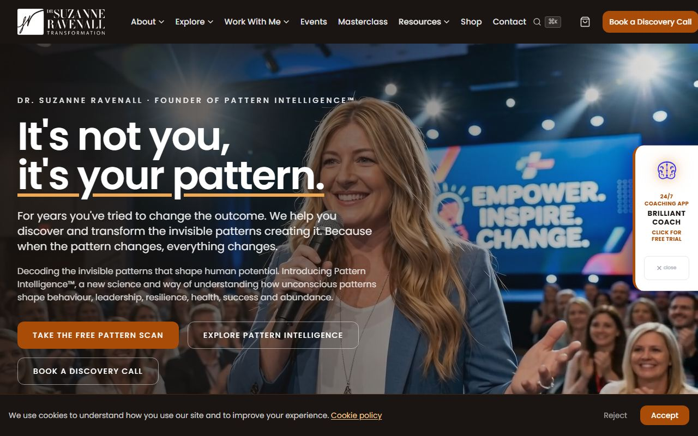
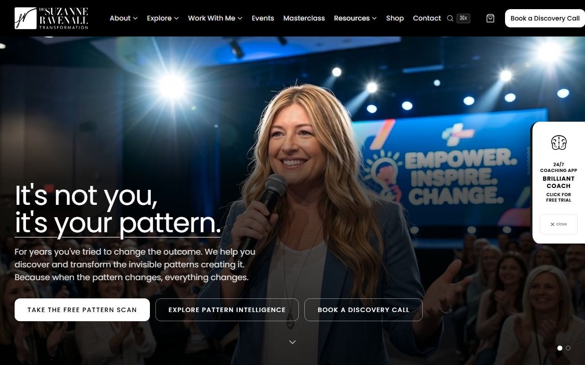
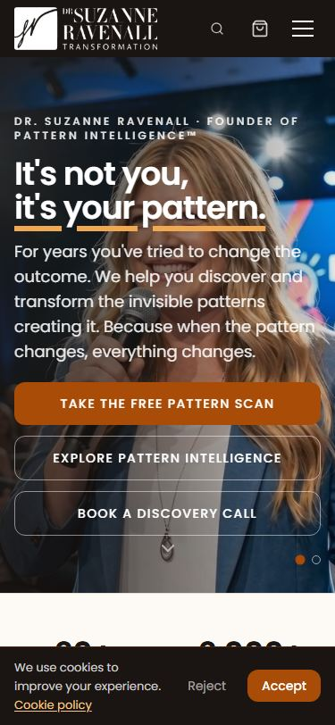
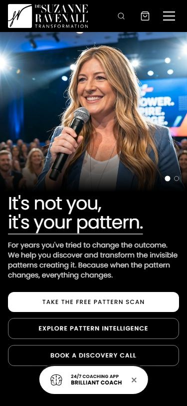
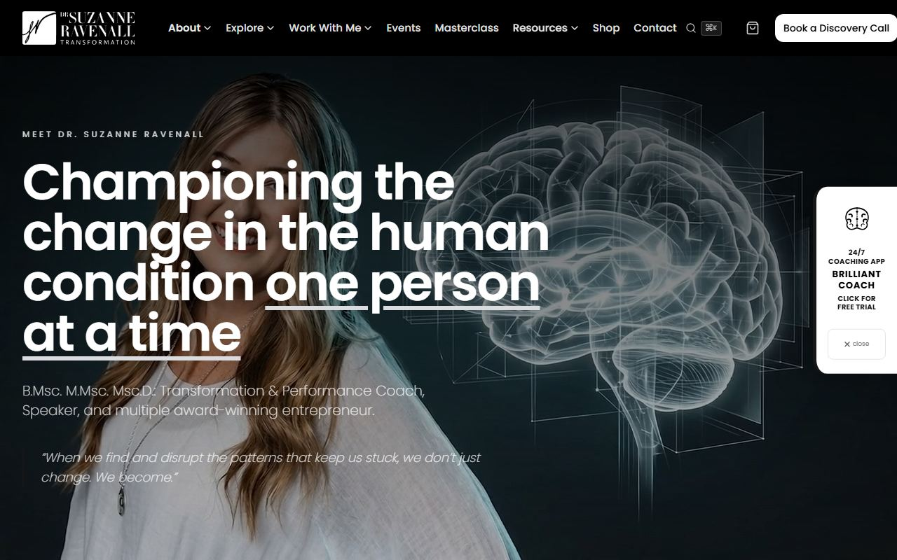
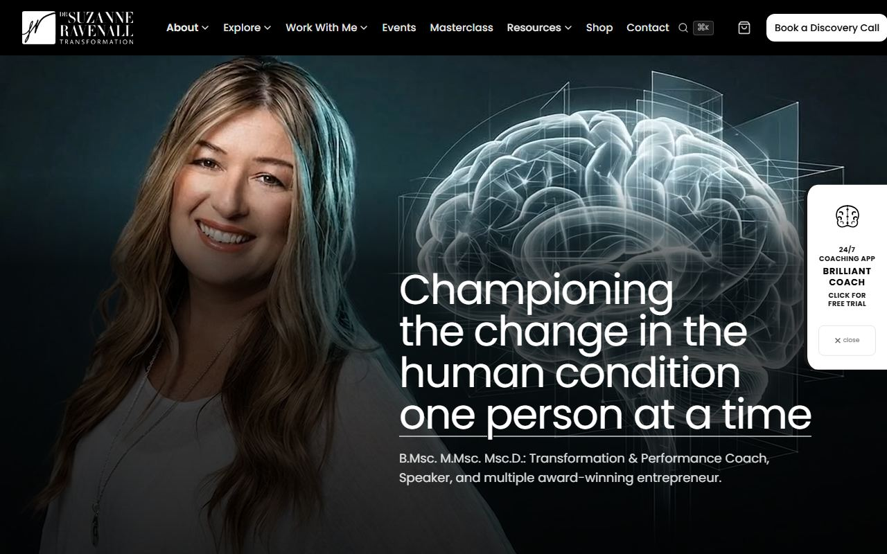
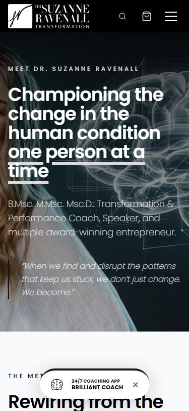
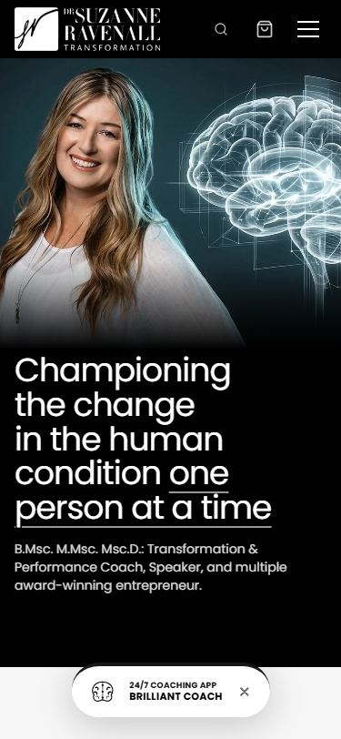

# Website progress: Thursday 17 September 2026

Hi Suzanne,

This is the first of the short progress notes we promised. You will get one every second working day until Tuesday 29 September.

## What you asked for

On 14 September you said the headings were too big and too bold and blocked out the background picture, and that you were not keen on the orange and brown.

## What we changed

**A calmer colour scheme.** The site is now black, white and a soft light grey. It is the same approach tonyrobbins.com uses: the colour comes from your photographs, not from the page. There is no orange, brown or bright blue anywhere.

**Headings that let the picture show.** Headings over a photograph are now smaller and lighter, and they sit at the bottom of the picture on a soft dark band, so the photograph itself stays clear. Where you stand on the left of a photograph, the heading moves to the right so it does not cover you. On a phone the picture sits above the text, so nothing covers your face.

## Finished and live

Every page of the site now has the new look. You can see it on the review site: http://169.239.180.49

### 1. Home page

A smaller, lighter headline and one line of description. We removed the small "Dr. Suzanne Ravenall · Founder of Pattern Intelligence" line above the headline, because your name is already in the logo directly above it.

Before:

After:

On a phone, before and after:

 

### 2. About page, plus The Story, The System and The Science

The same approach on all four pages. On the About page the headline sits on the right of the picture, so it no longer covers you in the video.

Before:

After:

On a phone, before and after:

 

### 3. All the other pages

Programmes and the shop (including every product page, the cart and checkout), events, contact, services, speaking, the masterclass, Explore and its eight topics, the transformation pathways, resources, the blog, the book page, testimonials, the pattern quiz pages, Pattern Coach, community, search and the legal pages. The words on every page are exactly as they were; only the look has changed.

### Small fixes along the way

- Some buttons had become hard to see against dark photographs. They are now white and easy to spot.
- The play buttons on the video testimonials are now white, so they stand out on every video.
- A few error messages on the checkout and contact forms were too faint to read comfortably. They are now darker.
- Two accreditation logos, AADP and the Royal Society of Medicine, were not showing on the old version at all. They now show properly.

## Coming next

Between now and Tuesday 29 September we will check every page on a phone and on a computer, and fix anything that comes up.

## What we need from you

1. **The main photograph at the top of the home page.** We are using the stage photograph for now. If you would prefer a different picture there, for example your black and white studio portrait, just tell us which one.
2. **The stage video on the home page and the Speaking page.** It has a few close-up moments where the headline sits across your face on a computer screen. A different clip, or a still photograph, would fix it, so this could be part of the same photo choice.
3. **The picture on the Emotional Mastery page.** It also appears on the home page, in the areas of focus. It has some leftover words printed into the image itself, such as "new, streamlined, electric-blue neural pathways". It needs replacing. Do you have a photograph you would like there, or shall we suggest one?

## How to reply

Reply with anything you would like changed. If we have not heard from you within two working days, we will take it that you are happy and keep going.
